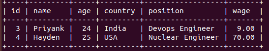

# trainee_backend
Nodejs,MySQL
### For the clone this backend part 
```
$ git clone https://github.com/dangar0090/trainee_backend.git
```
### Project structure for backend
```
/server
.gitignore
package.json
server.js
package-lock.json
```
### For Start backend part
```
$ cd server
npm i
node server.js
```

### These are the Dependencies that we include in our package.json file
```
dotenv
cors
express
mysql

```
### our backend server is running on port number 3001
### For backend part we use MySQL Database.
## For download MySQL
```
$ sudo apt-get install mysql-server
```
## For check version of MySQL
```
$ mysql --version
```
### For our backend part we create Database employeedb
```
CREATE DATABASE employeedb;
USE employeedb;
```
### We create a table 'employees' inside our database for storing our employees information.
```
CREATE TABLES employees;
```

### Testing of our backend functions- 

Adding employees- Here, we can see how we can enter the details of the employee in the website to add it into our database


Checking employees- Check if the added employee's data is reflected on the website


Updating employee- Here, we can see how we can update the value of wage of an Employee 


Checking updated table- Check if the updated data is reflected in the database



